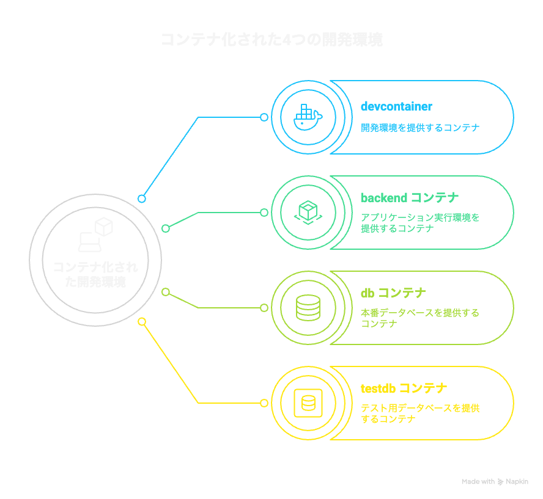
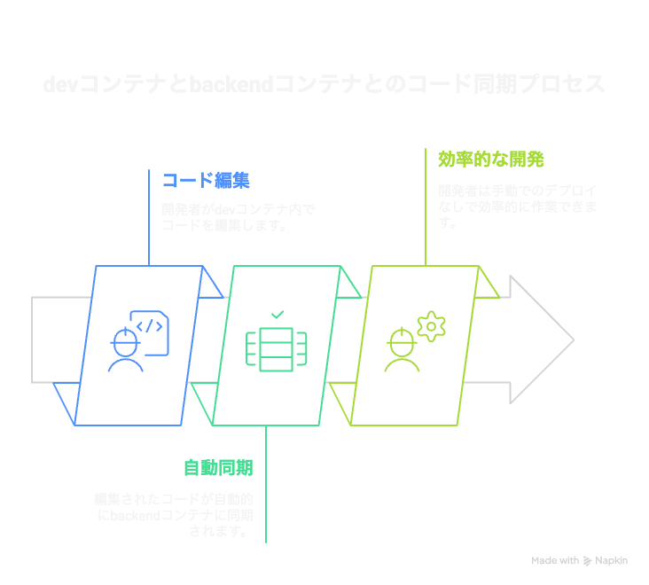
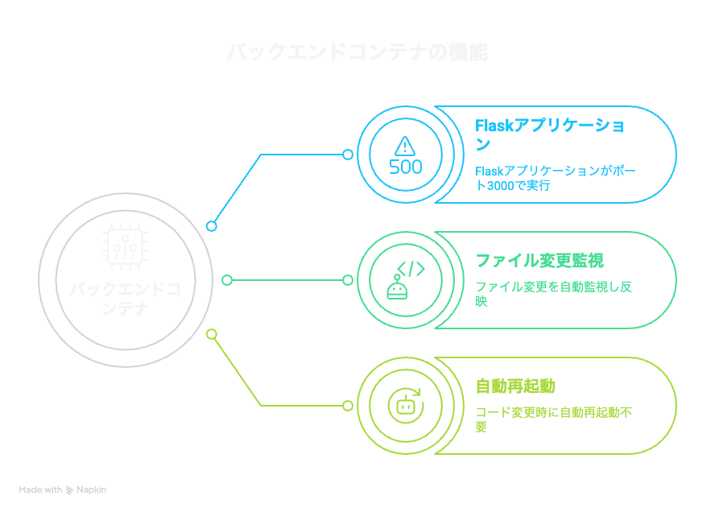

# 使い方  
devcontainer立ち上げ直後は  
```
source backend/.venv/bin/activate
```  
で仮想環境をアクティベートして作業してください。  


# コンテナベースの開発環境の概要

このドキュメントでは、開発用の `devcontainer`、アプリケーション実行用の `backend` コンテナ、本番データベース用の `db` コンテナ、テスト用の `testdb` コンテナの4つのコンポーネントからなるシステムの構成について説明します。開発者が効率的にコードを編集し、アプリケーションを実行するための仕組みを詳述します。

## システム構成

このシステムは以下の4つのコンテナで構成されています。

- **devcontainer**: 開発環境  
- **backend コンテナ**: アプリケーション実行環境  
- **db コンテナ**: 本番データベース  
- **testdb コンテナ**: テスト用データベース  




## 開発者の作業フロー

開発者は `devcontainer` に入ってコードを編集します。この環境は、開発に特化した設定が施されており、必要なツールやライブラリが揃っています。


## コードの同期

`devcontainer` 内で編集されたコードは、ボリュームを介して `backend` コンテナに自動的に同期されます。この仕組みにより、開発者は手動でのデプロイやファイル転送を行う必要がなく、効率的に作業を進めることができます。



## アプリケーションの実行

`backend` コンテナでは `run.py` が起動しており、Flask アプリケーションを **ポート 3000** でリッスンしています。このコンテナにはファイル変更監視機能（例: `nodemon` 相当）が実装されており、コードの変更が自動的に反映されます。そのため、再起動の必要はなく、開発者はスムーズに作業を続けることができます。



## 開発環境の役割

このシステムにおいて、アプリケーションの実行は `backend` コンテナで行われるため、`devcontainer` 内でアプリケーションを実行（例: `uv run run.py`）する必要はありません。`devcontainer` はあくまで **開発と編集のための環境**として機能します。
